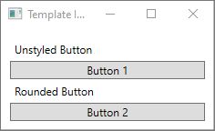
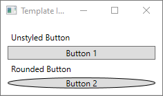
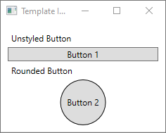
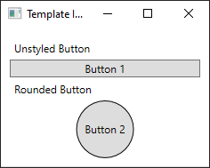
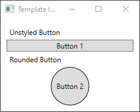

# Create a template for a control

With Windows Presentation Foundation (WPF), you can customize an existing control's visual structure and behavior with your own reusable template. Templates can be applied globally to your application, windows and pages, or directly to controls. Most scenarios that require you to create a new control can be covered by instead creating a new template for an existing control.

[!INCLUDE [desktop guide under construction](../../../includes/desktop-guide-preview-note.md)]

In this article, you'll explore creating a new <xref:System.Windows.Controls.ControlTemplate> for the <xref:System.Windows.Controls.Button> control.

## When to create a ControlTemplate

Controls have many properties, such as <xref:System.Windows.Controls.Border.Background%2A>, <xref:System.Windows.Controls.Control.Foreground%2A>, and <xref:System.Windows.Controls.Control.FontFamily%2A>. These properties control different aspects of the control's appearance, but the changes that you can make by setting these properties are limited. For example, you can set the <xref:System.Windows.Controls.Control.Foreground%2A> property to blue and <xref:System.Windows.Controls.Control.FontStyle%2A> to italic on a <xref:System.Windows.Controls.CheckBox>. You create a <xref:System.Windows.Controls.ControlTemplate> when you want to customize the control's appearance beyond what setting the other properties on the control will do.

In most user interfaces, a button has the same general appearance: a rectangle with some text. If you wanted to create a rounded button, you normally have to create a new control that inherits from the button or recreates the functionality of the button. Your new user control would then provide that circular visual.

You can avoid creating new controls by customizing the visual layout of an existing control. With a rounded button, you create a <xref:System.Windows.Controls.ControlTemplate> with the wanted visual layout.

On the other hand, if you need a control with new functionality, different properties, and new settings, you would create a new <xref:System.Windows.Controls.UserControl>.

## Prerequisites

Create a new WPF application and in *MainWindow.xaml* (or another window of your choice) set the following properties on the `<Window>` element:

|     |     |
| --- | --- |
| **Title**         | `Template Intro Sample` |
| **SizetoContent** | `WidthAndHeight` |
| **MinWidth**      | `250` |

Set the content of the `<Window>` element to the following XAML:

```xaml
<StackPanel Margin="10">
    <Label>Unstyled Button</Label>
    <Button>Button 1</Button>
    <Label>Rounded Button</Label>
    <Button>Button 2</Button>
</StackPanel>
```

In the end, the *MainWindow.xaml* file should look similar to the following:

```xaml
<Window x:Class="IntroToStylingAndTemplating.MainWindow"
        xmlns="http://schemas.microsoft.com/winfx/2006/xaml/presentation"
        xmlns:x="http://schemas.microsoft.com/winfx/2006/xaml"
        xmlns:d="http://schemas.microsoft.com/expression/blend/2008"
        xmlns:mc="http://schemas.openxmlformats.org/markup-compatibility/2006"
        xmlns:local="clr-namespace:IntroToStylingAndTemplating"
        mc:Ignorable="d"
        Title="Template Intro Sample" SizeToContent="WidthAndHeight" MinWidth="250">
    <StackPanel Margin="10">
        <Label>Unstyled Button</Label>
        <Button>Button 1</Button>
        <Label>Rounded Button</Label>
        <Button>Button 2</Button>
    </StackPanel>
</Window>
```

If you run the application, it looks like the following:



## Create a ControlTemplate

The most common way to declare a <xref:System.Windows.Controls.ControlTemplate> is as a resource in the `Resources` section in a XAML file. Because templates are resources, they obey the same scoping rules that apply to all resources. Put simply, where you declare a template affects where the template can be applied. For example, if you declare the template in the root element of your application definition XAML file, the template can be used anywhere in your application. If you define the template in a window, only the controls in that window can use the template.

To start with, add a `Window.Resources` element to your *MainWindow.xaml* file:

```xaml
<Window x:Class="IntroToStylingAndTemplating.MainWindow"
        xmlns="http://schemas.microsoft.com/winfx/2006/xaml/presentation"
        xmlns:x="http://schemas.microsoft.com/winfx/2006/xaml"
        xmlns:d="http://schemas.microsoft.com/expression/blend/2008"
        xmlns:mc="http://schemas.openxmlformats.org/markup-compatibility/2006"
        xmlns:local="clr-namespace:IntroToStylingAndTemplating"
        mc:Ignorable="d"
        Title="Template Intro Sample" SizeToContent="WidthAndHeight" MinWidth="250">
    <Window.Resources>

    </Window.Resources>
    <StackPanel Margin="10">
        <Label>Unstyled Button</Label>
        <Button>Button 1</Button>
        <Label>Rounded Button</Label>
        <Button>Button 2</Button>
    </StackPanel>
</Window>
```

Create a new `<ControlTemplate>` with the following properties set:

|     |     |
| --- | --- |
| **x:Key**         | `roundbutton` |
| **TargetType**    | `Button` |

This control template will be simple. A root element for the control, a <xref:System.Windows.Controls.Grid>. An <xref:System.Windows.Shapes.Ellipse> to draw the rounded appearance of the button. And a <xref:System.Windows.Controls.ContentPresenter> to display the user-specified button content.

```xaml
<ControlTemplate x:Key="roundbutton" TargetType="Button">
    <Grid>
        <Ellipse Fill="{TemplateBinding Background}" Stroke="{TemplateBinding Foreground}" />
        <ContentPresenter HorizontalAlignment="Center" VerticalAlignment="Center" />
    </Grid>
</ControlTemplate>
```

### TemplateBinding

When you create a new <xref:System.Windows.Controls.ControlTemplate>, you still might want to use the public properties to change the control's appearance. The [TemplateBinding](../../framework/wpf/advanced/templatebinding-markup-extension.md) markup extension binds a property of an element that is in the <xref:System.Windows.Controls.ControlTemplate> to a public property that is defined by the control. When you use a [TemplateBinding](../../framework/wpf/advanced/templatebinding-markup-extension.md), you enable properties on the control to act as parameters to the template. That is, when a property on a control is set, that value is passed on to the element that has the [TemplateBinding](../../framework/wpf/advanced/templatebinding-markup-extension.md) on it.

### Ellipse

Notice that the `Fill` and `Stroke` properties of the `<Ellipse>` element are bound to the controls <xref:System.Windows.Controls.Control.Foreground> and <xref:System.Windows.Controls.Control.Background> properties.

### ContentPresenter

A [\<ContentPresenter>](xref:System.Windows.Controls.ContentPresenter) element is also added to the template. Because this template is designed for a button, we have to take into consideration that the button inherits from <xref:System.Windows.Controls.ContentControl>. The button presents the content of the element. You can set anything inside of the button, such as plain text or even another control. Both of the following are valid buttons:

```xaml
<Button>My Text</Button>

<!-- and -->

<Button>
    <CheckBox>Checkbox in a button</CheckBox>
</Button>
```

In both of the examples above, the text and the checkbox are set as to the [Button.Content](xref:System.Windows.Controls.ContentControl.Content) property. Whatever is set as the content can be presented through a `<ContentPresenter>`, which is what the template does.

If the <xref:System.Windows.Controls.ControlTemplate> is applied to a <xref:System.Windows.Controls.ContentControl> type, such as a `Button`, a <xref:System.Windows.Controls.ContentPresenter> is searched for in the element tree. If the `ContentPresenter` is found, the template automatically binds the control's <xref:System.Windows.Controls.ContentControl.Content> property to the `ContentPresenter`.

## Use the template

Find the buttons that were declared at the start of this article.

```xaml
<StackPanel Margin="10">
    <Label>Unstyled Button</Label>
    <Button>Button 1</Button>
    <Label>Rounded Button</Label>
    <Button>Button 2</Button>
</StackPanel>
```

Set the second button's <xref:System.Windows.Controls.Control.Template> property to the `roundbutton` resource:

```xaml
<StackPanel Margin="10">
    <Label>Unstyled Button</Label>
    <Button>Button 1</Button>
    <Label>Rounded Button</Label>
    <Button Template="{StaticResource roundbutton}">Button 2</Button>
</StackPanel>
```

If you run the project and look at the result, you'll see that the button has a rounded background.



You may have noticed that the button isn't a circle but is skewed. Because of the way the `<Ellipse>` element works, it always expands to fill the available space. Make the circle uniform by changing the button's `width` and `height` properties to the same value:

```xaml
<StackPanel Margin="10">
    <Label>Unstyled Button</Label>
    <Button>Button 1</Button>
    <Label>Rounded Button</Label>
    <Button Template="{StaticResource roundbutton}" Width="65" Height="65">Button 2</Button>
</StackPanel>
```



## Add a Trigger

Even though a button with a template applied looks different, it behaves the same as any other button. If you press the button, the <xref:System.Windows.Controls.Primitives.ButtonBase.Click> event fires. However, you may have noticed that when you move your mouse over the button, the button's visuals don't change. These visual interactions are all defined by the template.

With the dynamic event and property systems that WPF provides, you can watch a specific property for a value and then restyle the template when appropriate. In this example, you'll watch the button's <xref:System.Windows.UIElement.IsMouseOver> property. When the mouse is over the control, style the `<Ellipse>` with a new color. This type of trigger is known as a **PropertyTrigger**.

For this to work though, you'll need to add a name to the `<Ellipse>` that you can reference. Give it the name of `backgroundElement`.

```xaml
<Ellipse x:Name="backgroundElement" Fill="{TemplateBinding Background}" Stroke="{TemplateBinding Foreground}" />
```

Next, add a new <xref:System.Windows.Trigger> to the [ControlTemplate.Triggers](xref:System.Windows.Controls.ControlTemplate.Triggers) collection. The trigger will watch the `IsMouseOver` for the value `true`.

```xaml
<ControlTemplate x:Key="roundbutton" TargetType="Button">
    <Grid>
        <Ellipse x:Name="backgroundElement" ... />
        <ContentPresenter ... />
    </Grid>
    <ControlTemplate.Triggers>
        <Trigger Property="IsMouseOver" Value="true">

        </Trigger>
    </ControlTemplate.Triggers>
</ControlTemplate>
```

Next, add a `<Setter>` to the `<Trigger>` that changes the `Fill` property of the `<Ellipse>` to a new color.

```xaml
<Trigger Property="IsMouseOver" Value="true">
    <Setter Property="Fill" TargetName="backgroundElement" Value="AliceBlue"/>
</Trigger>
```

Run the project. Notice that when you move the mouse over the button, the color of the `<Ellipse>` changes.



## Use a VisualState

Visual states are defined and triggered by a control. For example, when the mouse is moved on top of the control, the `CommonStates.MouseOver` state is triggered. You can animate property changes based on the current state of the control. In the previous section, a **PropertyTrigger** was used to change the foreground of the button to `AliceBlue` when the `IsMouseOver` property was `true`. Instead, create a visual state that animates the change of this color, providing a smooth transition. For more information about `VisualStates`, see [Styles and templates in WPF](styles-templates-overview.md#visual-states).

To convert the **PropertyTrigger** to an animated visual state, First, remove the `<ControlTemplate.Triggers>` element from your template.

Next, in the `<Grid>` root of the control template, add the `<VisualStateManager.VisualStateGroups>` element with a `<VisualStateGroup>` for `CommonStates`. Define two states, `Normal` and `MouseOver`.

```xaml
<ControlTemplate x:Key="roundbutton" TargetType="Button">
    <Grid>
        <VisualStateManager.VisualStateGroups>
            <VisualStateGroup Name="CommonStates">
                <VisualState Name="Normal">
                </VisualState>
                <VisualState Name="MouseOver">
                </VisualState>
            </VisualStateGroup>
        </VisualStateManager.VisualStateGroups>

        ...
```

Any animations defined in a `<VisualState>` will be applied when that state is triggered. Create animations for each state.

- Normal

  This state animates the ellipse fill, restoring it to the control's `Background` color.

  ```xaml
  <ColorAnimation Storyboard.TargetName="backgroundElement" 
                  Storyboard.TargetProperty="(Shape.Fill).(SolidColorBrush.Color)"
                  To="{TemplateBinding Background}"
                  Duration="0:0:0.3"/>
  ```

- MouseOver

  This state animates the ellipse `Background` color to a new color: `Yellow`.

  ```xaml
  <ColorAnimation Storyboard.TargetName="backgroundElement" 
                  Storyboard.TargetProperty="(Shape.Fill).(SolidColorBrush.Color)" 
                  To="Yellow" 
                  Duration="0:0:0.3"/>
  ```

The `<ControlTemplate>` should now look like the following.

```xaml
<ControlTemplate x:Key="roundbutton" TargetType="Button">
    <Grid>
        <VisualStateManager.VisualStateGroups>
            <VisualStateGroup Name="CommonStates">
                <VisualState Name="Normal">
                    <Storyboard>
                        <ColorAnimation Storyboard.TargetName="backgroundElement" 
                            Storyboard.TargetProperty="(Shape.Fill).(SolidColorBrush.Color)"
                            To="{TemplateBinding Background}"
                            Duration="0:0:0.3"/>
                    </Storyboard>
                </VisualState>
                <VisualState Name="MouseOver">
                    <Storyboard>
                        <ColorAnimation Storyboard.TargetName="backgroundElement" 
                            Storyboard.TargetProperty="(Shape.Fill).(SolidColorBrush.Color)" 
                            To="Yellow" 
                            Duration="0:0:0.3"/>
                    </Storyboard>
                </VisualState>
            </VisualStateGroup>
        </VisualStateManager.VisualStateGroups>
        <Ellipse Name="backgroundElement" Fill="{TemplateBinding Background}" Stroke="{TemplateBinding Foreground}" />
        <ContentPresenter x:Name="contentPresenter" HorizontalAlignment="Center" VerticalAlignment="Center" />
    </Grid>
</ControlTemplate>
```

Run the project. Notice that when you move the mouse over the button, the color of the `<Ellipse>` animates.



## Next steps

- [Create a style for a control in WPF](styles-templates-create-apply-style.md)
- [Styles and templates in WPF](styles-templates-overview.md)
- [Overview of XAML Resources](xaml-resources-define.md)
